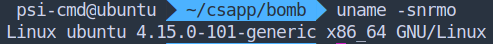
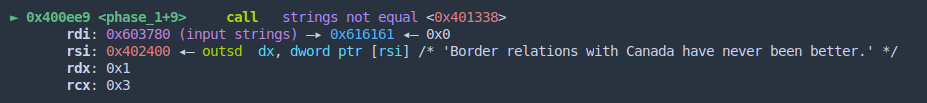
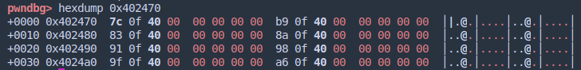
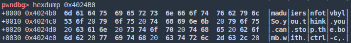
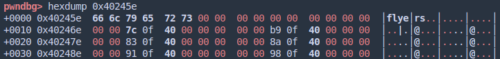
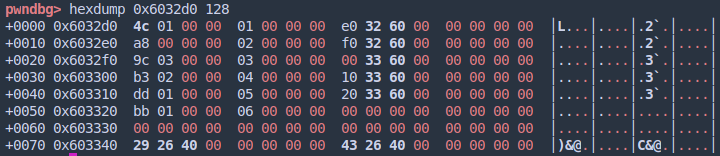

<p align="center" style="font-size:30px">Bomb Lab Report</p>

### 一、实验内容

使用gdb调试手段，经分析获得6个解密字符串，避免触发 “explosion”。

### 二、实验目的

了解x86_64架构下汇编语言算数指令，流程控制，调用过程的实现机制。

### 三、实验环境

- VMware虚拟机内  

- 使用 gdb 的 pwndbg 插件，hyper 终端分栏辅助显示。

  

- **pwndbg 使用 INTEL 语法**

### 四、实验过程与认识

#### 认识（写在前面）

- 遇到库函数（plt表中）不应继续跟踪，可以直接查询文档跳过。
- 数据移动时，移动到哪里不需要特别关心，主要关心数据什么时候如何被使用。
- 寄存器在使用时经常不同长度名称混用（rcx，ecx，cl等），一定要注意都指的是一个寄存器，否则就会丢数据。

#### 实验过程：

##### 第一题：

1. 解压，打开文件夹：bomb，bomb.c

2. 先打开 bomb.c，一共六个关卡。

3. 静态反汇编：`objdump -d > bomb.out` 备用

4. 目录下打开 gdb，加载 pwndbg 插件后，`b main` 下断点准备调试。

5. `r (run)` 

6. 跳过前面的读文件操作，第一个函数是 `initialize_bomb()` ，使用 `s (step)  `跟踪后发现`signal@plt` 

   ```bash
   $ man signal
   ...
   signal() sets the disposition of the signal signum to handler, which is either SIG_IGN, SIG_DFL, or the address of a programmer-defined function (a "signal handler").
   ...
   ```

   即 signal 为修改系统信号处理函数的函数。如果在 ida_64 中反汇编可知这里是替换了 `ctrl+c` ，故 `fin` 略过该函数。

7. 来到第一个待解函数，随意输入字符串后跟踪下一步。发现 `string_not_equal()` 函数调用。

   基本猜测在比较两个字符串，由于传入的两个参数之一为内存中的字符串，可直接复制来做为输入。

   

   故第一题解决，结果为 `Border relations with Canada have never been better.`

   如果认真分析此处反汇编结果（指令地址前多余的0去掉后）：
   ```gas
   pwndbg> disass 0x401338 
   Dump of assembler code for function strings_not_equal:
   => 0x0401338 <+0>:     push   r12
      0x040133a <+2>:     push   rbp
      0x040133b <+3>:     push   rbx	#保存寄存器
      0x040133c <+4>:     mov    rbx,rdi 
      0x040133f <+7>:     mov    rbp,rsi	#caller保存两个寄存器，
      0x0401342 <+10>:    call   0x40131b <string_length> #测长度，rdi未动直接用
      0x0401347 <+15>:    mov    r12d,eax	
      0x040134a <+18>:    mov    rdi,rbp	#下一传参准备
      0x040134d <+21>:    call   0x40131b <string_length>
      0x0401352 <+26>:    mov    edx,0x1
      0x0401357 <+31>:    cmp    r12d,eax
      0x040135a <+34>:    jne    0x40139b <strings_not_equal+99> #不等长返回1
      0x040135c <+36>:    movzx  eax,BYTE PTR [rbx]
      0x040135f <+39>:    test   al,al	#若al（rbx所指位）为0（字符串结尾），返回0
      0x0401361 <+41>:    je     0x401388 <strings_not_equal+80>
      0x0401363 <+43>:    cmp    al,BYTE PTR [rbp+0x0]
      0x0401366 <+46>:    je     0x401372 <strings_not_equal+58>
      0x0401368 <+48>:    jmp    0x40138f <strings_not_equal+87> #返回1
      0x040136a <+50>:    cmp    al,BYTE PTR [rbp+0x0]
      0x040136d <+53>:    nop    DWORD PTR [rax]	#无操作指令，意义不明
      0x0401370 <+56>:    jne    0x401396 <strings_not_equal+94> #循环中有一处不等就返1
      0x0401372 <+58>:    add    rbx,0x1 #递增索引变量 rbx负责输入串指针
      0x0401376 <+62>:    add    rbp,0x1 #rbp负责对照串指针
      0x040137a <+66>:    movzx  eax,BYTE PTR [rbx]
      0x040137d <+69>:    test   al,al #判0 	#最终由于同时到达字符串末尾，从这里退出返回0
      0x040137f <+71>:    jne    0x40136a <strings_not_equal+50>
      0x0401381 <+73>:    mov    edx,0x0
      0x0401386 <+78>:    jmp    0x40139b <strings_not_equal+99>
      0x0401388 <+80>:    mov    edx,0x0
      0x040138d <+85>:    jmp    0x40139b <strings_not_equal+99>
      0x040138f <+87>:    mov    edx,0x1
      0x0401394 <+92>:    jmp    0x40139b <strings_not_equal+99>
      0x0401396 <+94>:    mov    edx,0x1
      0x040139b <+99>:    mov    eax,edx
      0x040139d <+101>:   pop    rbx	#还原寄存器
      0x040139e <+102>:   pop    rbp
      0x040139f <+103>:   pop    r12
      0x04013a1 <+105>:   ret    
   End of assembler dump.
   ```

##### 第二题：

1. 根据源代码提示为数字，随意输入后查看`phase_2` 中情况，看到`explode_bomb` 调用之前决定性函数为`read_six_numbers` ，跟踪进入。随后找到 `sscanf@plt` ，与熟悉的 scanf 类似，应该是按指定格式将字符串中的内容提取为对应格式并写入传入的地址。该函数以前一概为参数准备阶段，传入输入串，格式化串，以及连续的 6 个 4 bit 间隔的地址（应该是一个 int_32 数组），最终返回成功匹配的个数。

2. 这里检测了如果返回的个数小于 5 个便失败。

3. 分析`read_six_numbers` 之后的指令：

   ```gas
      0x0400f05 <+9>:     call   0x40145c <read_six_numbers>
   => 0x0400f0a <+14>:    cmp    DWORD PTR [rsp],0x1 #首先即为比较第一个数和1大小（rsp 为数组首地址）
      0x0400f0e <+18>:    je     0x400f30 <phase_2+52>
      0x0400f10 <+20>:    call   0x40143a <explode_bomb>
      0x0400f15 <+25>:    jmp    0x400f30 <phase_2+52>
      0x0400f17 <+27>:    mov    eax,DWORD PTR [rbx-0x4] #之前的一个数（修改rbx后）
      0x0400f1a <+30>:    add    eax,eax #二倍，并比较
      0x0400f1c <+32>:    cmp    DWORD PTR [rbx],eax 
      0x0400f1e <+34>:    je     0x400f25 <phase_2+41> # 等于继续
      0x0400f20 <+36>:    call   0x40143a <explode_bomb>
      0x0400f25 <+41>:    add    rbx,0x4 #递增
      0x0400f29 <+45>:    cmp    rbx,rbp #与上界比较
      0x0400f2c <+48>:    jne    0x400f17 <phase_2+27>  # 数6个数，跳出
      0x0400f2e <+50>:    jmp    0x400f3c <phase_2+64>
      0x0400f30 <+52>:    lea    rbx,[rsp+0x4] #下一个数
      0x0400f35 <+57>:    lea    rbp,[rsp+0x18] #数组上界
      0x0400f3a <+62>:    jmp    0x400f17 <phase_2+27>
      0x0400f3c <+64>:    add    rsp,0x28
      0x0400f40 <+68>:    pop    rbx
      0x0400f41 <+69>:    pop    rbp
      0x0400f42 <+70>:    ret    
   End of assembler dump.
   ```

4. 则第二题答案为：`1 2 4 8 16 32`

##### 第三题：

1. 仍然随意输入字符串进入查看，首先`sscanf@plt` 读取，格式化字符串为两个数，调整输入后，分析如下：

   ```gas
      0x0400f5b <+24>:    call   0x400bf0 <__isoc99_sscanf@plt>
      0x0400f60 <+29>:    cmp    eax,0x1
      0x0400f63 <+32>:    jg     0x400f6a <phase_3+39> #两个整数才能跳转
      0x0400f65 <+34>:    call   0x40143a <explode_bomb>
   => 0x0400f6a <+39>:    cmp    DWORD PTR [rsp+0x8],0x7 #第一个数必小于7（之前rsp+8做为第三个参数给										sscanf用于承接第一个整数了，可见此时进行比较的是第一个数。）
      0x0400f6f <+44>:    ja     0x400fad <phase_3+106>
      0x0400f71 <+46>:    mov    eax,DWORD PTR [rsp+0x8]
      0x0400f75 <+50>:    jmp    QWORD PTR [rax*8+0x402470] #!
   ```

2. 此处为关键，`rax` 直接决定按照哪一块内存中的数进行跳转。观察数`0x402470`与之前格式字符串的地址接近，故地址存储在 `.rodata` 段中。当然，`pwndbg` 直接提供 `hexdump` 命令。

   

3. 理论上我们也许希望直接到达函数底部直接返回，然而没有这个选项。

   ```gas
      ...
      0x0400f7c <+57>:    mov    eax,0xcf #0 - 207
      0x0400f81 <+62>:    jmp    0x400fbe <phase_3+123>
      0x0400f83 <+64>:    mov    eax,0x2c3 #2 - 707
      0x0400f88 <+69>:    jmp    0x400fbe <phase_3+123>
      0x0400f8a <+71>:    mov    eax,0x100 #3 - 256
      0x0400f8f <+76>:    jmp    0x400fbe <phase_3+123>
      0x0400f91 <+78>:    mov    eax,0x185 #4 - 389
      0x0400f96 <+83>:    jmp    0x400fbe <phase_3+123>
      0x0400f98 <+85>:    mov    eax,0xce #5 - 206
      0x0400f9d <+90>:    jmp    0x400fbe <phase_3+123>
      0x0400f9f <+92>:    mov    eax,0x2aa #6 - 682
      0x0400fa4 <+97>:    jmp    0x400fbe <phase_3+123>
      0x0400fa6 <+99>:    mov    eax,0x147 #7 - 327
      0x0400fab <+104>:   jmp    0x400fbe <phase_3+123>
      0x0400fad <+106>:   call   0x40143a <explode_bomb>
      0x0400fb2 <+111>:   mov    eax,0x0
      0x0400fb7 <+116>:   jmp    0x400fbe <phase_3+123>
      0x0400fb9 <+118>:   mov    eax,0x137 #1 - 311
      0x0400fbe <+123>:   cmp    eax,DWORD PTR [rsp+0xc]
      0x0400fc2 <+127>:   je     0x400fc9 <phase_3+134>
      0x0400fc4 <+129>:   call   0x40143a <explode_bomb>
      0x0400fc9 <+134>:   add    rsp,0x18
      0x0400fcd <+138>:   ret
   ```
但是我们可以看到，中间从 7c 到 b9，都可以选择，只需要调整自己输入的第二个值就可以。
   
   故上面注释中均为答案。

##### 第四题：

进入函数，读取两个数，进入`func 4` ，随后可以发现递归情况。

```gas
pwndbg> disass func4 
Dump of assembler code for function func4: #edi第一个输入的数 esi=0 edx=0xe
   0x0400fce <+0>:     sub    rsp,0x8
   0x0400fd2 <+4>:     mov    eax,edx # 0xe
   0x0400fd4 <+6>:     sub    eax,esi # 0xe
   0x0400fd6 <+8>:     mov    ecx,eax # 0xe
   0x0400fd8 <+10>:    shr    ecx,0x1f # 0
   0x0400fdb <+13>:    add    eax,ecx # 0xe
   0x0400fdd <+15>:    sar    eax,1 # 7
   0x0400fdf <+17>:    lea    ecx,[rax+rsi*1] # 7
   0x0400fe2 <+20>:    cmp    ecx,edi ## < edi从未被改变过。所以edi（第一个输入的数）为7
   0x0400fe4 <+22>:    jle    0x400ff2 <func4+36>
   0x0400fe6 <+24>:    lea    edx,[rcx-0x1] #递归之前，传入的三个参数只有最后一个被改动。
   0x0400fe9 <+27>:    call   0x400fce <func4> #递归处
   0x0400fee <+32>:    add    eax,eax
   0x0400ff0 <+34>:    jmp    0x401007 <func4+57>
   0x0400ff2 <+36>:    mov    eax,0x0  #这里使eax=0
   0x0400ff7 <+41>:    cmp    ecx,edi ## < 这里对应的两处大于等于和小于等于表明ecx与edi（输入的第一个数）相等即可。
   0x0400ff9 <+43>:    jge    0x401007 <func4+57>
   0x0400ffb <+45>:    lea    esi,[rcx+0x1]
   0x0400ffe <+48>:    call   0x400fce <func4>
   0x0401003 <+53>:    lea    eax,[rax+rax*1+0x1]
   0x0401007 <+57>:    add    rsp,0x8
   0x040100b <+61>:    ret    
End of assembler dump.
```

然而经过观察：

```gas
   0x0401048 <+60>:    call   0x400fce <func4>
   0x040104d <+65>:    test   eax,eax  #eax等于0即可使ZF=1，从而避免跳转
   0x040104f <+67>:    jne    0x401058 <phase_4+76>
   0x0401051 <+69>:    cmp    DWORD PTR [rsp+0xc],0x0
   0x0401056 <+74>:    je     0x40105d <phase_4+81> #这里就是第二个数，第二个数没有被改变，所以第二个数直接为0即可。
   0x0401058 <+76>:    call   0x40143a <explode_bomb>
   0x040105d <+81>:    add    rsp,0x18
   0x0401061 <+85>:    ret    
End of assembler dump.
```

根据`func 4` 函数中后两个参数确定，可以直接在第一轮确定第一个数为7，不需进入递归，故答案为`7 0`

##### 第五题：

1. 进入函数`phase_5` ，首先看到`canary` 保护，暂且略过。

2. 随后看到要求字符串长度为 6，并有许多跳转。应该是一个字符串加密变换机制

   ```gas
   Dump of assembler code for function phase_5:
      ...
      0x040107a <+24>:    call   0x40131b <string_length>
   => 0x040107f <+29>:    cmp    eax,0x6
      0x0401082 <+32>:    je     0x4010d2 <phase_5+112>
      0x0401084 <+34>:    call   0x40143a <explode_bomb>
      0x0401089 <+39>:    jmp    0x4010d2 <phase_5+112>
      0x040108b <+41>:    movzx  ecx,BYTE PTR [rbx+rax*1] #这里是逐个选取字符的位置
      0x040108f <+45>:    mov    BYTE PTR [rsp],cl #rsp位置始终未被修改，是一个可靠的临时变量位置
      0x0401092 <+48>:    mov    rdx,QWORD PTR [rsp] #rdx除此也没有改变，且注意
      0x0401096 <+52>:    and    edx,0xf #保留末四位
      0x0401099 <+55>:    movzx  edx,BYTE PTR [rdx+0x4024b0] #原来输入进去的字符末四位用来定位
      0x04010a0 <+62>:    mov    BYTE PTR [rsp+rax*1+0x10],dl #放入既定数组
      0x04010a4 <+66>:    add    rax,0x1
      0x04010a8 <+70>:    cmp    rax,0x6
      0x04010ac <+74>:    jne    0x40108b <phase_5+41> #循环
      0x04010ae <+76>:    mov    BYTE PTR [rsp+0x16],0x0 #\0字符串结尾
      0x04010b3 <+81>:    mov    esi,0x40245e #这里有一个串，比对密钥
      0x04010b8 <+86>:    lea    rdi,[rsp+0x10]
      0x04010bd <+91>:    call   0x401338 <strings_not_equal>
      0x04010c2 <+96>:    test   eax,eax
      0x04010c4 <+98>:    je     0x4010d9 <phase_5+119>
      0x04010c6 <+100>:   call   0x40143a <explode_bomb>
      0x04010cb <+105>:   nop    DWORD PTR [rax+rax*1+0x0]
      0x04010d0 <+110>:   jmp    0x4010d9 <phase_5+119>
      0x04010d2 <+112>:   mov    eax,0x0 #初始化计数器
      0x04010d7 <+117>:   jmp    0x40108b <phase_5+41>
      0x04010d9 <+119>:   mov    rax,QWORD PTR [rsp+0x18]
      0x04010de <+124>:   xor    rax,QWORD PTR fs:0x28 # canary 检查
      0x04010e7 <+133>:   je     0x4010ee <phase_5+140>
      0x04010e9 <+135>:   call   0x400b30 <__stack_chk_fail@plt>
      0x04010ee <+140>:   add    rsp,0x20
      0x04010f2 <+144>:   pop    rbx
      0x04010f3 <+145>:   ret
   ```

   

   

3. 由以上分析可知，输入的六个字符后四位决定偏移查询方式，找到六个目标字母为：（ascii 表不在此贴出）

   |      目标串      |  f   |  l   |  y   |  e   |  r   |  s   |
   | :--------------: | :--: | :--: | :--: | :--: | :--: | :--: |
   |    对应偏移量    |  9   |  F   |  E   |  5   |  6   |  7   |
| 选择串（非唯一） |  y   |  o   |  n   |  e   |  f   |  g   |
   
   按16进制表示选择符合要求的串如：`yonefg` 即可

##### 第六题：

直接上指令分析：（对无意义处进行优化）

```gas
Dump of assembler code for function phase_6:
=> ...
   0x04010fc <+8>:     sub    rsp,0x50 #开辟数组，rsp为头，但分配了20个整数的空位
   0x0401100 <+12>:    mov    r13,rsp
   0x0401103 <+15>:    mov    rsi,rsp
   0x0401106 <+18>:    call   0x40145c <read_six_numbers>
   0x040110b <+23>:    mov    r14,rsp #r14 ①
   0x040110e <+26>:    mov    r12d,0x0                  #循环1计数器，开始循环
   0x0401114 <+32>:    mov    rbp,r13
   0x0401117 <+35>:    mov    eax,DWORD PTR [r13]
   0x040111b <+39>:    sub    eax,0x1
   0x040111e <+42>:    cmp    eax,0x5 #第一个数必须小于等于6大于等于1（以及后面的数）
   0x0401121 <+45>:    jbe    0x401128 <phase_6+52> #暗示无符号比较
   0x0401123 <+47>:    call   0x40143a <explode_bomb>
   0x0401128 <+52>:    add    r12d,0x1
   0x040112c <+56>:    cmp    r12d,0x6                  #外循环1退出判断
   0x0401130 <+60>:    je     0x401153 <phase_6+95>
   0x0401132 <+62>:    mov    ebx,r12d
   0x0401135 <+65>:    movsxd rax,ebx
   0x0401138 <+68>:    mov    eax,DWORD PTR [rsp+rax*4] 
   0x040113b <+71>:    cmp    DWORD PTR [rbp],eax #前后两个数不能相等
   0x040113e <+74>:    jne    0x401145 <phase_6+81>
   0x0401140 <+76>:    call   0x40143a <explode_bomb>
   0x0401145 <+81>:    add    ebx,0x1
   0x0401148 <+84>:    cmp    ebx,0x5
   0x040114b <+87>:    jle    0x401135 <phase_6+65> #内循环
   0x040114d <+89>:    add    r13,0x4 #前进4字节
   0x0401151 <+93>:    jmp    0x401114 <phase_6+32>       #循环1回转点
   		#初步判断以上循环1过程仅为检验数字小于等于6且互不相等。确定6个数为 1~6
   0x0401153 <+95>:    lea    rsi,[rsp+0x18] #rsp其实一直是数组首地址，rsi值跳过了开始的六个整数
   0x0401158 <+100>:   mov    rax,r14 #r14 ② 把数组首地址传过来
   0x040115b <+103>:   mov    ecx,0x7
   0x0401160 <+108>:   mov    edx,ecx
   0x0401162 <+110>:   sub    edx,DWORD PTR [rax] #7减第1个数到第6个数
   0x0401164 <+112>:   mov    DWORD PTR [rax],edx #覆盖
   0x0401166 <+114>:   add    rax,0x4
   0x040116a <+118>:   cmp    rax,rsi #这里是指针比较判断退出循环
   0x040116d <+121>:   jne    0x401160 <phase_6+108>
   0x040116f <+123>:   mov    esi,0x0 #循环2计数器
   0x0401174 <+128>:   jmp    0x401197 <phase_6+163>                   #循环2开始（先跳转）
   0x0401176 <+130>:   mov    rdx,QWORD PTR [rdx+0x8] #观察目标内存位置，发现+0x8位置值为下一节点首地址
   0x040117a <+134>:   add    eax,0x1 #eax开始等于rsi（跳过开始整数）
   0x040117d <+137>:   cmp    eax,ecx #别忘了ecx从下面得到，是第n个数
   0x040117f <+139>:   jne    0x401176 <phase_6+130> #（这种操作是链表吧！
   0x0401181 <+141>:   jmp    0x401188 <phase_6+148>
   0x0401183 <+143>:   mov    edx,0x6032d0
   0x0401188 <+148>:   mov    QWORD PTR [rsp+rsi*2+0x20],rdx #在32字节之后插入8字节一组的链表节点地址
   0x040118d <+153>:   add    rsi,0x4
   0x0401191 <+157>:   cmp    rsi,0x18 #数6个数
   0x0401195 <+161>:   je     0x4011ab <phase_6+183>                   #循环2出口
   0x0401197 <+163>:   mov    ecx,DWORD PTR [rsp+rsi*1] #第一个数
   0x040119a <+166>:   cmp    ecx,0x1 #一定有一个数等于1
   0x040119d <+169>:   jle    0x401183 <phase_6+143> #放入链表首地址
   0x040119f <+171>:   mov    eax,0x1
   0x04011a4 <+176>:   mov    edx,0x6032d0
   0x04011a9 <+181>:   jmp    0x401176 <phase_6+130>                   #循环2回转点
       #以上循环2对“链表”地址进行了记录。
   0x04011ab <+183>:   mov    rbx,QWORD PTR [rsp+0x20] #址1指向的链表地址
   0x04011b0 <+188>:   lea    rax,[rsp+0x28] #址2（栈上）（rax一直指向栈）
   0x04011b5 <+193>:   lea    rsi,[rsp+0x50] #尾
   0x04011ba <+198>:   mov    rcx,rbx 
   0x04011bd <+201>:   mov    rdx,QWORD PTR [rax] #址2指向的链表地址 #循环3开始
   0x04011c0 <+204>:   mov    QWORD PTR [rcx+0x8],rdx #重新连接链表，按2->1，3->2这样连
   0x04011c4 <+208>:   add    rax,0x8
   0x04011c8 <+212>:   cmp    rax,rsi
   0x04011cb <+215>:   je     0x4011d2 <phase_6+222>              #循环3出口
   0x04011cd <+217>:   mov    rcx,rdx #表2首给表1，下一步表2跟随rax成为表3
   0x04011d0 <+220>:   jmp    0x4011bd <phase_6+201>              #循环3回转点
   0x04011d2 <+222>:   mov    QWORD PTR [rdx+0x8],0x0 #NULL
   0x04011da <+230>:   mov    ebp,0x5
   0x04011df <+235>:   mov    rax,QWORD PTR [rbx+0x8] #第二指针
   0x04011e3 <+239>:   mov    eax,DWORD PTR [rax] #第二指针的值
   0x04011e5 <+241>:   cmp    DWORD PTR [rbx],eax  #和第一指针值做比较 注意比的是32位整数
   0x04011e7 <+243>:   jge    0x4011ee <phase_6+250> #大于等于即可
   0x04011e9 <+245>:   call   0x40143a <explode_bomb>
   0x04011ee <+250>:   mov    rbx,QWORD PTR [rbx+0x8]
   0x04011f2 <+254>:   sub    ebp,0x1
   0x04011f5 <+257>:   jne    0x4011df <phase_6+235> # 最后一次循环，链表前面的数恒大于后面即可
   0x04011f7 <+259>:   add    rsp,0x50
   ...
   0x0401203 <+271>:   ret
```



最终思路：通过排列 1~6 六个数字，决定链表顺序，从而使最终链表的第一位值小于等于第二位，第二位小于等于第三位......

其实图中查看的结果还是很贴心的把数字标了出来，在第二大列里`01 02 03 04 05 06` 正代表跳转次数对应的行数。

结果为：`4 3 2 1 6 5` 

*到此，该实验正式部分终于完成了！*

##### 彩蛋关：

源码中有提示未完成的关卡，在`phase_defused` 中可以搜寻到`secret_phase` 函数

```gas
Dump of assembler code for function phase_defused:
=> 0x04015c4 <+0>:     sub    rsp,0x78
   0x04015c8 <+4>:     mov    rax,QWORD PTR fs:0x28
   0x04015d1 <+13>:    mov    QWORD PTR [rsp+0x68],rax
   0x04015d6 <+18>:    xor    eax,eax
   0x04015d8 <+20>:    cmp    DWORD PTR [rip+0x202181],0x6 # 0x603760 <num_input_strings>
   							 # 这里表明只有在最后一个defuse中secret_phase才会被调用
   0x04015df <+27>:    jne    0x40163f <phase_defused+123>
   0x04015e1 <+29>:    lea    r8,[rsp+0x10]
   0x04015e6 <+34>:    lea    rcx,[rsp+0xc]
   0x04015eb <+39>:    lea    rdx,[rsp+0x8]
   0x04015f0 <+44>:    mov    esi,0x402619 # x/s 0x402619: "%d %d %s"
   0x04015f5 <+49>:    mov    edi,0x603870 # 第四题输入的字符串
   0x04015fa <+54>:    call   0x400bf0 <__isoc99_sscanf@plt>
   0x04015ff <+59>:    cmp    eax,0x3
   0x0401602 <+62>:    jne    0x401635 <phase_defused+113>
   0x0401604 <+64>:    mov    esi,0x402622 # x/s 0x402622: "DrEvil"
   0x0401609 <+69>:    lea    rdi,[rsp+0x10]
   0x040160e <+74>:    call   0x401338 <strings_not_equal>
   0x0401613 <+79>:    test   eax,eax
   0x0401615 <+81>:    jne    0x401635 <phase_defused+113>
   0x0401617 <+83>:    mov    edi,0x4024f8
   0x040161c <+88>:    call   0x400b10 <puts@plt>
   0x0401621 <+93>:    mov    edi,0x402520
   0x0401626 <+98>:    call   0x400b10 <puts@plt>
   0x040162b <+103>:   mov    eax,0x0
   0x0401630 <+108>:   call   0x401242 <secret_phase>
   0x0401635 <+113>:   mov    edi,0x402558
   0x040163a <+118>:   call   0x400b10 <puts@plt>
   0x040163f <+123>:   mov    rax,QWORD PTR [rsp+0x68]
   0x0401644 <+128>:   xor    rax,QWORD PTR fs:0x28
   0x040164d <+137>:   je     0x401654 <phase_defused+144>
   0x040164f <+139>:   call   0x400b30 <__stack_chk_fail@plt>
   0x0401654 <+144>:   add    rsp,0x78
   0x0401658 <+148>:   ret
```

可以看到只需要将第四次输入后面加上 `DrEvil` 字符串即可进入 `secret_phase`。

```gas
Dump of assembler code for function secret_phase:
=> 0x0401242 <+0>:     push   rbx
   0x0401243 <+1>:     call   0x40149e <read_line>
   0x0401248 <+6>:     mov    edx,0xa # 10进制读取
   0x040124d <+11>:    mov    esi,0x0
   0x0401252 <+16>:    mov    rdi,rax
   0x0401255 <+19>:    call   0x400bd0 <strtol@plt>
   0x040125a <+24>:    mov    rbx,rax
   0x040125d <+27>:    lea    eax,[rax-0x1]
   0x0401260 <+30>:    cmp    eax,0x3e8 # 输入一个小于等于1001的数
   0x0401265 <+35>:    jbe    0x40126c <secret_phase+42>
   0x0401267 <+37>:    call   0x40143a <explode_bomb>
   0x040126c <+42>:    mov    esi,ebx # 输入的数
   0x040126e <+44>:    mov    edi,0x6030f0 # 预存放整数的地址
   0x0401273 <+49>:    call   0x401204 <fun7>
   0x0401278 <+54>:    cmp    eax,0x2 # 最后返回值为2
   0x040127b <+57>:    je     0x401282 <secret_phase+64>
   0x040127d <+59>:    call   0x40143a <explode_bomb>
   0x0401282 <+64>:    mov    edi,0x402438
   0x0401287 <+69>:    call   0x400b10 <puts@plt>
   0x040128c <+74>:    call   0x4015c4 <phase_defused>
   0x0401291 <+79>:    pop    rbx
   0x0401292 <+80>:    ret    
End of assembler dump.
```

```gas
Dump of assembler code for function fun7:
   0x0401204 <+0>:     sub    rsp,0x8
   0x0401208 <+4>:     test   rdi,rdi 
   0x040120b <+7>:     je     0x401238 <fun7+52> # 如果是 NULL，到树梢返回 -1
   0x040120d <+9>:     mov    edx,DWORD PTR [rdi]
   0x040120f <+11>:    cmp    edx,esi
   0x0401211 <+13>:    jle    0x401220 <fun7+28> # 与节点比较，大于等于节点（输入比节点大等）跳转
   0x0401213 <+15>:    mov    rdi,QWORD PTR [rdi+0x8] # 树左杈
   0x0401217 <+19>:    call   0x401204 <fun7>
   0x040121c <+24>:    add    eax,eax
   0x040121e <+26>:    jmp    0x40123d <fun7+57>
   0x0401220 <+28>:    mov    eax,0x0
   0x0401225 <+33>:    cmp    edx,esi
   0x0401227 <+35>:    je     0x40123d <fun7+57> # 如果与节点相等，返回0
   0x0401229 <+37>:    mov    rdi,QWORD PTR [rdi+0x10] # 树右杈
   0x040122d <+41>:    call   0x401204 <fun7>
   0x0401232 <+46>:    lea    eax,[rax+rax*1+0x1] # 这里的 +0x1 是关键
   0x0401236 <+50>:    jmp    0x40123d <fun7+57>
   0x0401238 <+52>:    mov    eax,0xffffffff
   0x040123d <+57>:    add    rsp,0x8
   0x0401241 <+61>:    ret    
End of assembler dump.
```

如果 rax 返回时为特定值 2，则不能遇到上面的两个 mov eax 指令，因此需要关注跳转指令。

再观察其中有两次递归调用，fun7 传入的参数是什么？一个是输入的值，另一个是地址，把地址 hexdump 之后


再结合代码分析，得出结论：这是一颗树。画一下图：


树左杈小于右杈。

同时可以看到如果没有命中（与节点相等），则一直递归下去，直到碰到 NULL，返回 -1。而如果内层函数返回一个负值，则无法在递归返回的过程中产生正值，所以必须命中。命中当场返回的是 0，而如果在树的右杈继续返回，可以得到 (eax = 2eax + 1)，从树的左杈返回，则可以得到 (eax = 2eax)。eax 等于 0 时需要一次右杈返回变成 1，随后进行一次左杈返回得 2。图中寻找答案，很显然为 0x14，0x23。由于是 10 进制，所以输入 20，35 即可解。

呃，由于最后的分析少分析了一次递归，35 并非正确答案，20 才是。

#### 五、总结

首先，我觉得能够先行系统地了解汇编还是很幸运的，至少对于汇编语法的思维有了一定适应性，不再无从下手。当然不得不说，人脑的寄存器数还是不够，经常是需要反复看十多分钟才能建立“变量”之间的联系，大概半个小时之后才能理解一个汇编片段所代表的宏观意义。这个实验前前后后大概做了一天半，但时间没有白费，终归是有所收获，期待下次实验。
