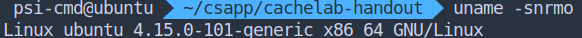
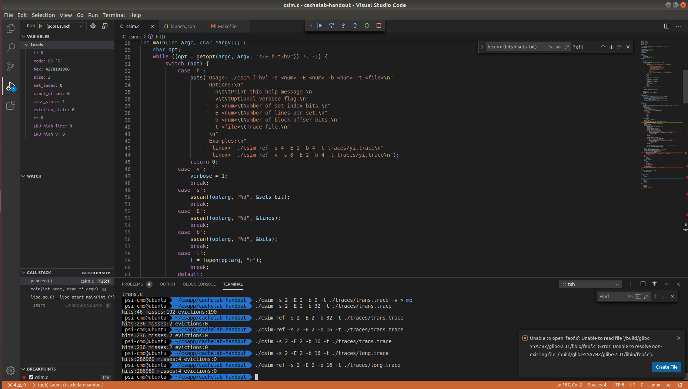
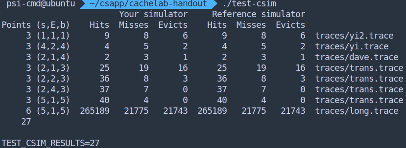
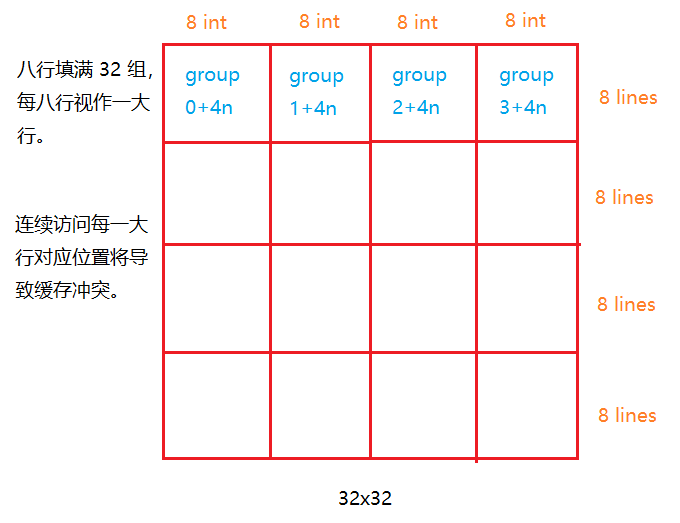
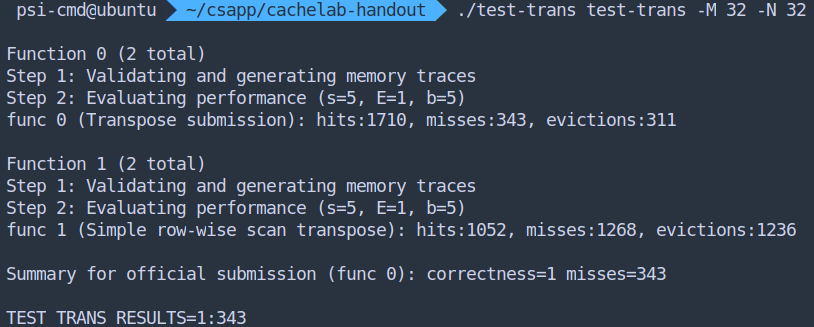
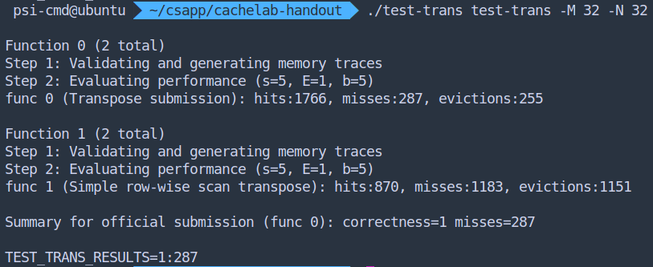
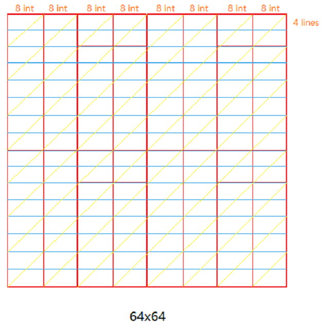
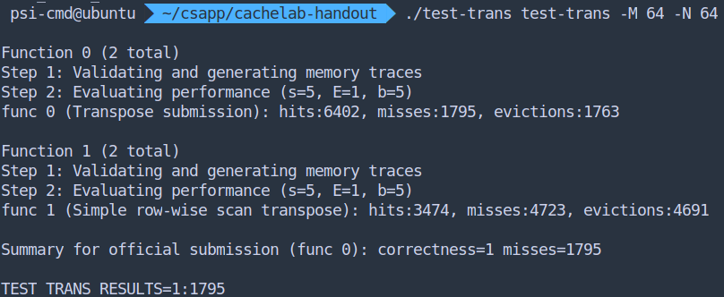
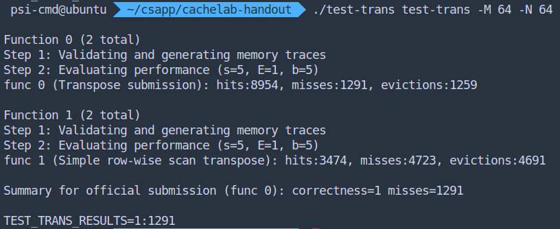

<p align="center" style="font-size:30px">Target Lab Report</p>

#### 一、实验内容

1. 使用 C 程序模拟缓存机制，理解缓存处理过程。s
2. 对一个矩阵转置进行优化，减少高速缓存 miss 次数。

#### 二、实验目的

​    理解内存机制，编写内存友好的程序，提供内存使用优化思路。

#### 三、实验环境

- VMware 虚拟机内 

- VS code & gdb

#### 四、实验过程

##### A 内存模拟实验

过程：（本来想贴代码加注释，觉得篇幅过长，代码另附，思路也在代码中。）

- LRU 机制的实现：维护一个计数变量，对于缓存中相连组的访问会导致所有相关组的变量加一，而命中的那一组该变量直接清零。这样出现缓存不命中时，哪一组计数变量最大，哪一组上一次访问就最久远，应当被替换。
- 几乎就是按照既定的规则来编写，也没有其他需要说明的。

结果：



- 最初的版本考虑到越界访问问题，但是 Writeup 文件中给出的条件是数据默认对齐，不需要考虑越界。（除非故意将每组 bit 数设置太小）
- 由于好长时间没有写 C 程序，导致某个严重的 bug 找了一天。（本来应该将 LRU 计数器值进行加一操作，结果递增到指针上了）

源码：csim.c

##### B 内存优化实验

局域性考量：理想状态下，应当把同组的所有数据都“用完”，再替换到下一组。即如果只访问同组高速缓存的部分就发生替换，就是对高速缓存的浪费。

对于矩阵转置而言，A 中每个值被读取一遍，B 中每个值被写入一遍，理想情况下每次访问都将缓存用完后，再切换。

就题目而言，给出内存结构：`-s 5 -E 1 -b 5` ，意味着 32 bit（8 个整数）可以放入一组，没有组相联情况可以降低考虑难度。同时给出测量标准：32x32, 64x64, 61x67 三种矩阵，并且可以通过判断输入分别进行优化。

**32x32**

1. 分析：



​		这里可以看到每 8 行将占满 32 组高速缓存，无优化算法问题在于对 B 矩阵的访问浪费了高速缓存。为了全面利用对 B 的访问，应当采取如上分块策略。

​		同时使用打印地址的方式可以看到检测函数中的 A 和 B 矩阵地址是相连的，说明访问 `A[1][1]` 后再访问 `B[1][1]`，高速缓存也会发生冲突替换。

​		所以对于非对角线分块，使用分块策略是最优。而对角线上的分块可以进一步优化。

2. 实现：

*对角线不区分的源码及结果：*

```c
char transpose_submit_desc[] = "Transpose submission";
void transpose_submit(int M, int N, int A[N][M], int B[M][N]){
    for (int i = 0; i < N; i+=8)
        for (int j = 0; j < M; j+=8)
            block_trans_8x8(M, N, &A[i][j], &B[j][i]);
}

void block_trans_8x8(int M, int N, int *A, int *B){
    for (int i = 0; i < 8; i++)
        for (int j = 0; j < 8; j++)
            B[j*N+i] = A[i*M+j];
}
```



**对角线区分策略**

a. 继续分块：实验证明，将对角线上的每个 8x8 分成 4x4，反而导致 miss 数量上升。粗略分析是细分后导致的缓存利用率下降高于冲突下降效果，导致总结果反而上升。

b. 规避冲突：经分析，A 分块访问没有缓存利用率问题，问题出在 B 分块进行访问时与 A 冲突，集中发生在对角线上。理想的规则是当读取 A 的第 n 行时，不能对 B 的第 n 行进行赋值，而是要存在一个临时变量里，等内存中恰好有 B 的第 n 行时再进行赋值，代码与结果如下：

```c
char transpose_submit_desc[] = "Transpose submission";
void transpose_submit(int M, int N, int A[N][M], int B[M][N]){
    for (int i = 0; i < N; i += 8)
        for (int j = 0; j < M; j += 8)
            block_trans_8x8(M, N, &A[i][j], &B[j][i], i==j);
}

void block_trans_8x8(int M, int N, int *A, int *B, int diag){
    int diag_temp = 0;
    for (int i = 0; i < 8; i++)
        for (int j = 0; j < 8; j++)
            if (i != j || !diag)
                B[j * N + i] = A[i * M + j];
            else {		// 对角线处理方式：存住A[0][0]的值，等内存中有B分块的第一行时赋值
                if (i)
                    B[(i - 1) * N + i - 1] = diag_temp;
                diag_temp = A[i * M + i];
            }
    if (diag)
        B[7 * N + 7] = diag_temp;  //把最后一个对角元赋值
}
```



达到 m 小于 300 目标。

**64x64**



1. 分析：如果分成 4 个 32x32 块，可能直接完成目标？可是改变不了 32x32 分块内存不连续的事实。
2. 如果继续方形分块策略并最大限度利用缓存，尝试改成 4x4 分块方式，对上面的方案进行数字替换得：



​		甚至落入了 m < 2000 的范围。

3. 由于4x4 分块显然仅仅利用了差不多一半的缓存，所以如何提高剩下缓存的利用率？

   如果进行一次 4x4 分块赋值，再紧接着进行一次 4x4 分块赋值，就可以减少一半浪费？

   --但是，事实上我们已经这样做了，当 A 矩阵在读取 4x4 时，平移的 4x4 窗口已经实现了利用另一部分缓存了。

   经过搜索，找到一种方案。可以让 B 在读取时不走回头路：

   将 A 所有在高速缓存中的内容尽可能复制给 B 的高速缓存，先不管位置是否正确，复制过去再考虑。方案是对于 4x8 块，前 4x4 块位置正确，后 4x4 块转置后赋给 B 剩下的高速缓存。随后用 4 个变量做缓存，将 b 中的数据缓存一行，赋值（用正确的 A 矩阵中的值）一行，替换一行。用该方法代码为：

   ```c
   char transpose_submit_desc[] = "Transpose submission";
   void transpose_submit(int M, int N, int A[N][M], int B[M][N])
   {
       int a, b, c, d;
       int diag_temp = 0;
       for (int i = 0; i < N; i += 8)
           for (int j = 0; j < M; j += 8){
               // block_trans_4x4(M, N, &A[i][j], &B[j][i], 0);
               for (int i1 = 0; i1 < 4; i1++)
                   for (int j1 = 0; j1 < 4; j1++)
                       if (i1 != j1 || i!=j)
                           (&B[j][i])[j1 * N + i1] = (&A[i][j])[i1 * M + j1];
                       else
                       {
                           if (i1)
                               (&B[j][i])[(i1 - 1) * N + i1 - 1] = diag_temp;
                           diag_temp = (&A[i][j])[i1 * M + i1];
                       }
               if (i==j)
                   (&B[j][i])[3 * N + 3] = diag_temp;
   
               // block_trans_4x4(M, N, &A[i][j+4], &B[j][i+4], 0);
               for (int i1 = 0; i1 < 4; i1++)
                   for (int j1 = 0; j1 < 4; j1++)
                       if (i1 != j1 || i!=j)
                           (&B[j][i+4])[j1 * N + i1] = (&A[i][j+4])[i1 * M + j1];
                       else
                       {
                           if (i1)
                               (&B[j][i+4])[(i1 - 1) * N + i1 - 1] = diag_temp;
                           diag_temp = (&A[i][j+4])[i1 * M + i1];
                       }
               if (i==j)
                   (&B[j][i+4])[3 * N + 3] = diag_temp;
   
               a = B[j][i+4]; B[j][i+4] = A[i+4][j];
               b = B[j][i+5]; B[j][i+5] = A[i+5][j];
               c = B[j][i+6]; B[j][i+6] = A[i+6][j];
               d = B[j][i+7]; B[j][i+7] = A[i+7][j];
               B[j+4][i] = a; B[j+4][i+1] = b; B[j+4][i+2] = c; B[j+4][i+3] = d;
   
               a = B[j+1][i+4]; B[j+1][i+4] = A[i+4][j+1];
               b = B[j+1][i+5]; B[j+1][i+5] = A[i+5][j+1];
               c = B[j+1][i+6]; B[j+1][i+6] = A[i+6][j+1];
               d = B[j+1][i+7]; B[j+1][i+7] = A[i+7][j+1];
               B[j+5][i] = a; B[j+5][i+1] = b; B[j+5][i+2] = c; B[j+5][i+3] = d;
   
               a = B[j+2][i+4]; B[j+2][i+4] = A[i+4][j+2];
               b = B[j+2][i+5]; B[j+2][i+5] = A[i+5][j+2];
               c = B[j+2][i+6]; B[j+2][i+6] = A[i+6][j+2];
               d = B[j+2][i+7]; B[j+2][i+7] = A[i+7][j+2];
               B[j+6][i] = a; B[j+6][i+1] = b; B[j+6][i+2] = c; B[j+6][i+3] = d;
   
               a = B[j+3][i+4]; B[j+3][i+4] = A[i+4][j+3];
               b = B[j+3][i+5]; B[j+3][i+5] = A[i+5][j+3];
               c = B[j+3][i+6]; B[j+3][i+6] = A[i+6][j+3];
               d = B[j+3][i+7]; B[j+3][i+7] = A[i+7][j+3];
               B[j+7][i] = a; B[j+7][i+1] = b; B[j+7][i+2] = c; B[j+7][i+3] = d;
               
               // block_trans_4x4(M, N, &A[i+4][j+4], &B[j+4][i+4], i==j);
               for (int i1 = 0; i1 < 4; i1++)
                   for (int j1 = 0; j1 < 4; j1++)
                       if (i1 != j1 || i!=j)
                           (&B[j+4][i+4])[j1 * N + i1] = (&A[i+4][j+4])[i1 * M + j1];
                       else
                       {
                           if (i1)
                               (&B[j+4][i+4])[(i1 - 1) * N + i1 - 1] = diag_temp;
                           diag_temp = (&A[i+4][j+4])[i1 * M + i1];
                       }
               if (i==j)
                   (&B[j+4][i+4])[3 * N + 3] = diag_temp;
           }
   }
   ```

   （非常遗憾的是，辅助函数声明 inline 关键字竟没有作用，必须手动将辅助函数嵌入主函数中才能获得最低 miss 数。并且刚好声明了 12 个变量。）

   

   **61x67**

   1. 两个质数，显然这种不规整的情况会导致缓存冲突图在矩阵上犬牙交错，不可能向上面分析得那么规则。最简单的解法可能就是暴力尝试分块，从 2 尝试到 51 ，最终可以得到一个最小值 1950，在块大小为 17x17 时取到。

      ```c
      void block_trans_nxn(int m, int n, int M, int N, int *A, int *B)
      {
          for (int i = 0; i < n; i++)
              for (int j = 0; j < m; j++)
                  B[j * N + i] = A[i * M + j]; 
      }
      
      void transpose_submit(int M, int N, int A[N][M], int B[M][N])
      {
          int i, j;
          for (i=0; i + BLOCK_N < N; i += BLOCK_N){
              for (j=0; j + BLOCK_N < M; j += BLOCK_N){
                  block_trans_nxn(BLOCK_N, BLOCK_N, M, N, &A[i][j], &B[j][i]);
              }
              block_trans_nxn(M % BLOCK_N, BLOCK_N, M, N, &A[i][j], &B[j][i]);
          }
          for (j=0; j + BLOCK_N < M; j += BLOCK_N){
                  block_trans_nxn(BLOCK_N, N % BLOCK_N, M, N, &A[i][j], &B[j][i]);
              }
              block_trans_nxn(M % BLOCK_N, N % BLOCK_N, M, N, &A[i][j], &B[j][i]);
      }
      ```
   
      （相对于整齐的分块，这里需要把不足块单独处理。）
   
      ```python
      #!/usr/bin/python3
      import os
      
      def main():
          for num in range(2, 62):
              print(f"BLOCK_N = {num}")
              with open("./trans.c", "r") as f:
                  lines = f.readlines()
              for i in range(len(lines)):
                  if "#define BLOCK_N" in lines[i]:
                      linelist = lines[i].split(' ')
                      linelist[-1] = str(num) + '\n'
                      lines[i] = ' '.join(linelist)
              with open("./trans.c", "w") as f:
                  f.write("".join(lines))
              os.system("make > /dev/null 2>/dev/null")
              os.system('./test-trans -M 61 -N 67')                
      
      if __name__ == '__main__':
          main()
      ```
   
      （暴力重新编译）
   
      | 分块大小 | VALID/MISS | 分块大小 | VALID/MISS | 分块大小 | VALID/MISS  |
      | -------- | ---------- | -------- | ---------- | -------- | ----------- |
      | 2        | 1/3115     | 22       | 1/1959     | 42       | 1/2732      |
      | 3        | 1/2648     | 23       | 1/1928     | 43       | 1/2829      |
      | 4        | 1/2425     | 24       | 1/2015     | 44       | 1/2928      |
      | 5        | 1/2296     | 25       | 1/2107     | 45       | 1/3019      |
      | 6        | 1/2224     | 26       | 1/2202     | 46       | 1/3119      |
      | 7        | 1/2152     | 27       | 1/2298     | 47       | 1/3211      |
      | 8        | 1/2118     | 28       | 1/2400     | 48       | 1/3306      |
      | 9        | 1/2092     | 29       | 1/2495     | 49       | 1/3404      |
      | 10       | 1/2076     | 30       | 1/2595     | 50       | 1/3495      |
      | 11       | 1/2089     | 31       | 1/2591     | 51       | 1/3593      |
      | 12       | 1/2057     | 32       | 1/2590     | 52       | 1/3692      |
      | 13       | 1/2048     | 33       | 1/2586     | 53       | 1/3787      |
      | 14       | 1/1996     | 34       | 1/2558     | 54       | 1/3877      |
      | 15       | 1/2021     | 35       | 1/2557     | 55       | 1/3973      |
      | 16       | 1/1992     | 36       | 1/2558     | 56       | 1/4054      |
      | 17 *     | 1/1950     | 37       | 1/2561     | 57       | 1/4138      |
      | 18       | 1/1961     | 38       | 1/2559     | 58       | 1/4225      |
      | 19       | 1/1979     | 39       | 1/2603     | 59       | 1/4312      |
      | 20       | 1/2002     | 40       | 1/2642     | 60       | 1/4394      |
      | 21       | 1/1957     | 41       | 1/2690     | 61       | (非法输入） |
   
   并且手动改变 nxn 交换函数为内联对结果没有影响。

#### 五、总结

​		本次实验过程比较曲折，之前只做完一半就去顾及其他的事情，过了一个月后差不多都忘了，需要重新捡起。当时做到 61x67 转置时，本来想通过画图解决问题，后来花了一个下午也没有找到一个合理的解决方案。最后在参考到网上其他文章的做法——暴力尝试后，感觉像被骗了一样。这个经历让我认识到快刀斩乱麻的重要性。因为即使有更巧妙的方法出现，其复杂的判断条件，以及更多的判断变量，极有可能抵消高缓存命中率带来的时间节约。

