
Data Lab Report

#### 一、实验内容

使用二进制运算符（& ^ | + << >> ! ~）完成指定运算。

#### 二、实验目的

理解C语言中数据类型的位级表示以及在这些数据类型上操作的位级行为。

#### 三、实验环境

- VMware虚拟机内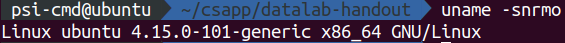
- 文本编辑器：vim

#### 四、实验过程

1. 解压文件：`tar xvf ./datalab-handout.tar`

2. 分析文件：

   - bits.c： 题目位置

   - btest：负责检查结果
   - fshow，ishow：提示整数浮点数结构
   - dlc：规则检查

3. 分析题目与解答：

   **以下内容均已经过btest检查**

   1. bitXor：`& ~` → `^`

      ​	分析：**与**操作可以筛选出同为1的位，在**按位取反**的帮助下可以筛选出同为0的位。由于没有或操作，筛选出的两个标志位串需要**取反**求**与**，才能得到两原串中相异的位。

      ​	解：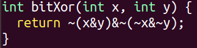

   2. tmin：取得补码下最小值

      ​	分析：最高位为1，**左移**31位即可。

      ​	解：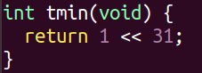

   3. isTmax：判断是否为有符号最大值

      ​	分析：由于没有移位操作，无法制造大数，故想到利用加法性质，对于32位串，取整数最大或取-1时，加1导致完全bit翻转。完全翻转由**异或**识别并**取反**后**逻辑非**，便于用0和1（而不是其他数）输出。同时为排除-1情况，需同时满足加一不等于0这一条件，则上述表达式应与 `!!(x+1)` **求与**，得到可靠结果。

      ​	解：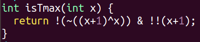

   4. allOddBits：判断是否所有奇数位为1

      ​	分析：结果以0，1显示，故可以考虑将奇数位全1的情况映射到0。即首先构造偶数位全1的位串，使用**或**运算将偶数位置1，如果原位串奇数位全1，经过运算后所有位为1，加一即为0。**取非**后达到要求。

      ​	解：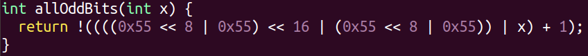

   5. negate：负数转换，按定义取反加一

      ​	解：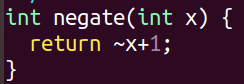

   6. isAsciiDigit：是否为ascii字符中的数字

      ​	分析：0x30\~0x39数字特征——只有低4位有区分，其他位10个数相同。故使用**异或**并**右移4位**来判断未知串高位情况（取逻辑非），使得高位相同时输出1，可进行下一步判断（否则返回0退出）。下一步分析低四位情况有两种，分别是第四位为0和第2，3位为0。满足这两个条件任意一个即可判定数字在0x30\~0x39之间。使用**与**运算单独处理两种情况，结果取**或**，具体实现如下：

      ​	解：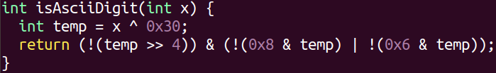

   7. conditional：条件表达式

      ​	（虽然非常想皮一下：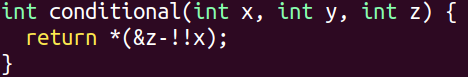

      ​	分析：x应当作为一条指令（一种操作），使不同x对同一对象操作时展现不同结果。一开始进入思维误区，以为表达式中只需要出现一个x。但是真正的选择策略，是在选中一方时完全屏蔽另一方的存在（开启一方所有控制门，并关闭另一方的所有控制门，两扇门保持同步），且两数之间使用**或运算**连接，**与运算**、全0全1串控制门，结果经简化如下：

      ​	正解：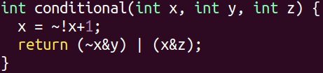

   8. isLessOrEqual：判断小于等于

      ​	分析：首先必然要判断两个变量的正负，将x负y正和y负x正两种情况单独挑选出来。使用右移31位的方式，将最高位铺满所有bit。再使用**取反**、**与**、**逻辑非**将这两种情况输出设为非0即1。随后解决同号情况下比较，使用**取反**加1实现相减，用与上面同样的方法判断正负，再使用恰当的逻辑关系将以上情况连接起来即可满足要求。（做过翻转最高位比较的尝试，但C语言内部无法判断溢出标志，故变换后两数相减的方式完全无法判断大小。）

      ​	解：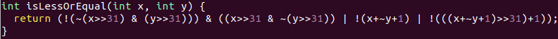

   9. logicalNeg：逻辑非

      ​	分析：逻辑非对所有位，只要有一个1就返回零。故需要将所有位以一定方式聚集到末位上，对末位进行判断。实现方法采用分段**或操作**，先右移16位和自己求或，再右移8位⋯⋯最终根据最后一位与1的异或返回0或1。

      ​	解：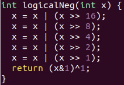

   10. howManyBits：至少多少位表示数

       ​	分析：最开始甚至没有明白示例中是怎么确定最少表示位的，最终搜索确认规则为正数找为1的最高位+1，负数找为0的最高位+1（表示符号位）。则将负数翻转为正数后统一统计1的位置。对于这种统计的方案大致还是16位->8位->4位⋯⋯高16位不为0，把高16位移下来继续检查16位到8位，依此类推。锁定高16位就加16，锁定高8位再加8⋯⋯完成对最高1的位置统计。

       ​	解：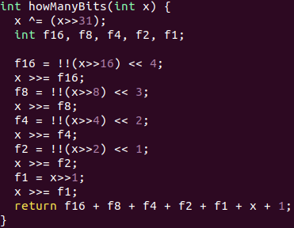

       *（来到浮点数环节）*

   11. floatScale2：浮点数乘2

       ​	分析：浮点数最重要的是将符号位，指数串和尾数串分开，所以可以先设两个量保留指数和浮点数。同时把特殊数分离，无穷，NaN单独返回，小量单独返回。最后处理普通浮点数。

       ​	解：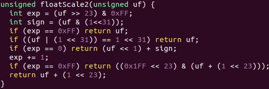

   12. floatFloat2Int：

       ​	分析：浮点数继续分为3段，同时对于指数部分，如果加1并屏蔽掉最高位，则可以做为左右移参量。首先根据指数筛掉无穷与NaN，随后将0和小量（8位exp最高位为0）筛去。判定左移过多溢出后，根据exp大小选定左移还是右移，根据符号位判定是否取反。

       ​	解：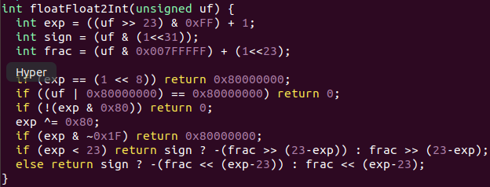

   13. floatPower2：

       ​	分析：一定是正数，尾数全0位，则限定指数范围并将指数放在指定位段上即可。

       ​	解：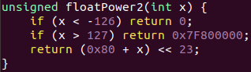

       （突然变简单有点不适应

   至此，本期实验结束。

   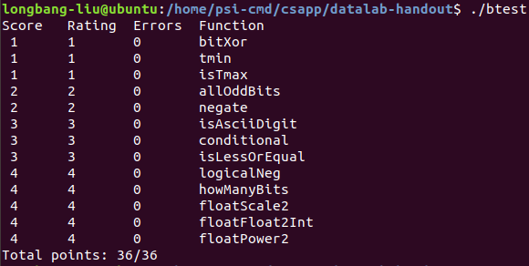

#### 五、总结

本次实验收获相当多，尤其是浮点数表示的理解。当然，也有一部分复杂解答逻辑表述不甚清晰，总之期待下次实验。

附：源码 bits.c