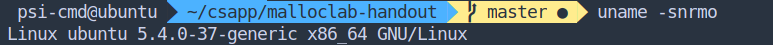
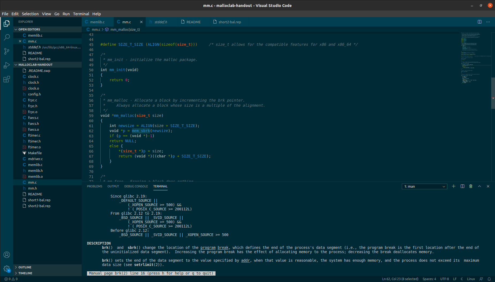
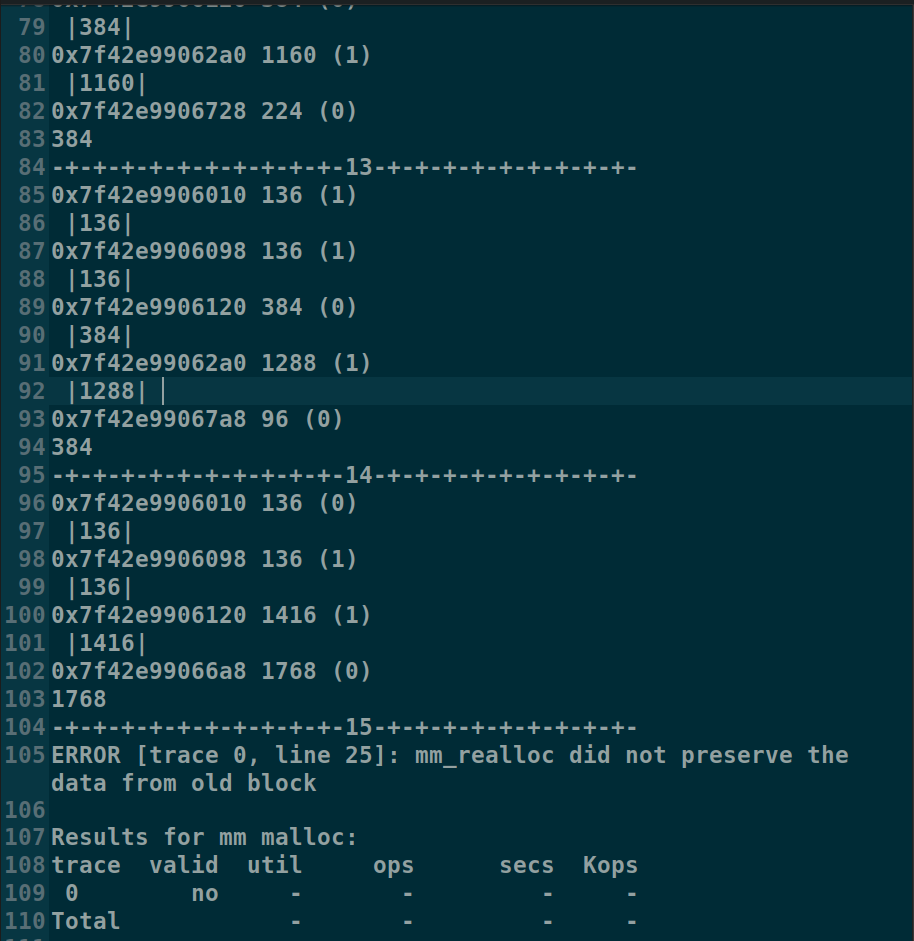
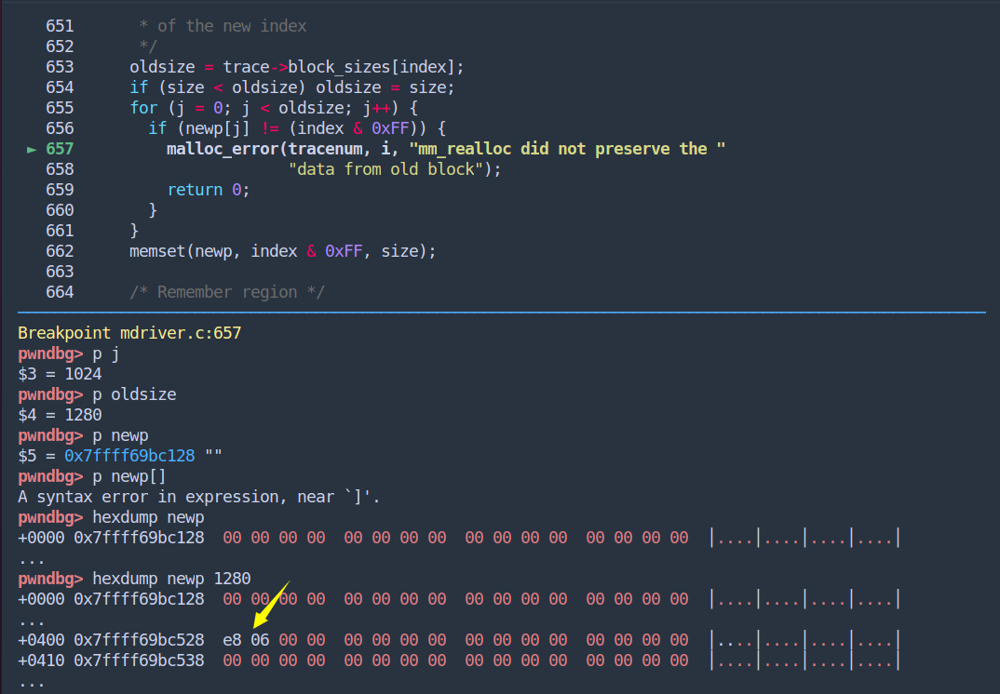
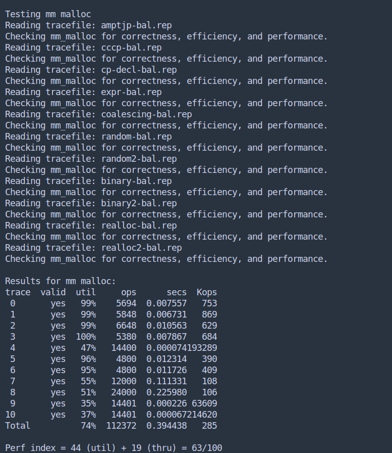

Malloc Lab Report

#### 一、实验内容

设计 malloc 内存分配器，完成内存的动态分配和释放。

#### 二、实验目的

理解内存的动态分配原理。

#### 三、实验环境

- VMware虚拟机内

- vscode 

  

#### 四、实验过程

1. 理解问题的背景：内存分配器，即是从系统中申请内存页，随后进行更精细化的管理，对上层应用提供内存服务。

2. 其中会出现各种策略，如：

   - Linux 底层使用 Buddy 算法分配，特点是分配块大小只能是 $2^n$，在参考现有算法之前，我所想象的内存分配方式就是这种。
   - Linux 底层之上有类似于 C 库的 Slab 管理机制，可以保证频繁的分配操作发生在同一块内存上，将碎片控制在一定范围。（slab 即内核专有的内存管理机制）
   - 对于分配器的 C 实现，glibc 版本为 ptmalloc2，同样还有 Google 开源的 tcmalloc 和 Facebook 的 jemalloc。而后两者在多线程的表现上由于 glibc 实现方案。
   - 各类高级语言往往有自己的内存分配回收方案，尤其是提供了垃圾回收机制的 java、python 等。

3. 对于各种分配方案，总会出现一些相当坏的情况，比如将分配器中现有内存都分配成小块，然后隔块释放，再申请大内存，显然会有任何算法都解决不了的碎片问题。所以不要使用极端特例去否认自己算法的可行性。

4. 方案探讨：

   1. 初始化函数预先使用 sbrk 接口获取一段内存，并初始化为一块有头部，有效位为 0 的大块，尾部用 0 结束。

   2. 申请分配：最开始修改头部，对齐位数由 size_t  决定，除了分配器申请的内存尾部用 0 结束外，分配出去的块不设置尾部。同时维护一个最大未分配 size，申请的分配大小要与该值进行比较，如果小于该值，遍历列表插空。如果大于该值，启动合并方案，并更新最大未分配 size。这里有两种方案：一是每进行一次合并，就比较一次。找到合适空位就返回。二是全体合并，筛选合适的最小空位再返回。显然时间倾向第一种，空间上倾向第二种。

      如果合并后仍然大于最大 size，申请分配下一个块。分配函数不需要考虑 mmap，因为只有 sbrk 的模拟接口。

   3. 回收：找到位置，有效位置 0。还可以选择顺便合并下一个块，减轻合并压力。

5. 开始实现：

   - 选取隐式链表 + 最佳适配方案

   - 注意：任何传入的块大小都要经过增加头部后进行对齐再使用，并全程使用对齐结果。

**Debug 环节**

1. 首先忐忑地运行第一遍，segmentation fault。——原来还是有指针没有初始化。
2. 修改后第二次，报错未对齐 8 字节。——回想一下，我之前对总长度进行了 8 字节处理，但是返回时还是用 `sizeof(size_t)` 返回。看来对于该程序，32 位下也只能浪费 8 字节在 header 上。想了想没有改源码，而是把 makefile 中 -m32 参数删除了，直接编译 64 位程序。
3. 随后就运行成功了，然而一看分数，怎么才有 40 分？原来前面计算的是空间利用率，我一开始申请的内存太大了，需要把大小减下来。
4. 削减大小（从 `1 << 20` 削减到 `1 << 10` ）后，继续报错，发生区间重叠。看来问题发生在内部扩大空间函数上，再次跟踪后发现。之前假定了一些全局变量经过了一次非扩容循环，全局变量 `new` 的指针正好指向链表的结尾。然而一开始内存大小就大于需求，于是 new 指针没有被更新到结尾，再分配发生重叠。
5. 通过了本目录下的两个 tracefile，然而真正的检验文件并不在压缩包内，需要自己从网上搜寻。
6. 搜寻到原始的检验文件后，继续检验发现继续报错，原因是最大值更新问题。全局变量存储了上一次分配结束后，堆内空闲的空间最大值。然而这个最大值在更新的过程中发生错误，导致返回了一个错误的（已分配的）区域。解决的方案是局域变量中引入第二大值，如果新分配的块使用了最大值对应的区间，则更新最大值时将剩余空间大小与第二大值进行比较确定最大值大小。调整后跑通了前面非 realloc 部分。
7. 剩下的两个 realloc 检验仍然出现错误：数据校验出错。主要问题在于复制数据之前进行了重分配空间，而重分配标识将数据截断了。解决方法是增加全局 realloc 地址变量与长度变量，如果 realloc 非 NULL，在重分配空间之前对该地址内容向目标地址进行一次拷贝，这样就可以保证数据的完整性了。

debug 图片两张

**结果**

（按照隐式链表的写法，所能查到的最高分是 67，是在采取立即适配的方案情况下（我采取的是最佳适配方案）。而如果想继续提高吞吐量，降低耗时，可以使用地址分离适配的方式。而一些广泛应用的实现一般对申请的空间大小进行了分层，进而根据层次按不同的分配方式使用）

#### 五、总结

​		这个实验，从理解到实现，还是需要跨越很大的“心里障碍”，最开始完全不知道“自己想得对不对”。不过只要迈出第一步，按照原理实现一个简单的内容，并在小的 tracefile 上实现后，就不会感到犹豫了。实验本身的确有助于深刻理解堆的机制，至少看起来不再是黑盒了。（CTF 也是一定会涉及堆漏洞的利用的）

源码：mm.c，编写中的设计思路都在注释中。

（写完实验才发现，原来我是书上示例看到一半就去做实验了。）

