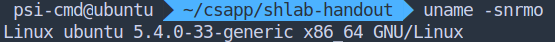
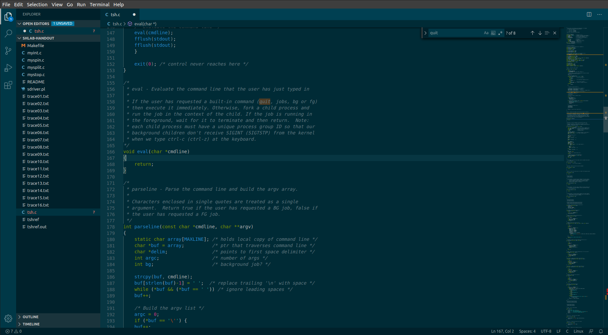
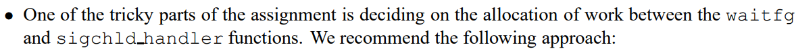

<p align="center" style="font-size:30px">Shell Lab Report</p>

### 一、实验内容

完成一个 shell 模板中的一些关键函数，满足运行程序与作业控制需求。

### 二、实验目的

理解操作系统系统调用、信号、与作业控制机制。

### 三、实验环境

- VMware虚拟机内

- Visual Studio Code

  

#### 四、实验流程

##### 确定实验目标：

1. 完成 `eval` 函数，用于运行内外部命令。
2. 完成 `builtin_cmd` 内建命令
3. 作业控制 `fg`、`bg`、`wait_fg`
4. `SIGCHLD`, `SIGINT`, `SIGTSTP` 信号处理

**实验过程：**

1. `eval` 函数：

   对于该函数，直接接受外部传入字符串，经 `parseline` 解析后分析为内部命令还是外部命令，并分别进行运行。首先实现运行外部命令。

   运行命令显然需要 `fork` 系统调用，随后是 `exec` 族函数跟进。`exec` 族函数中，后接 l 的函数参数不定，需要手动一个一个传入，称为 list 方式。而后接 v 的函数以字符串指针数组的方式传参，成为 vector 方式 。而`parseline` 接口适合做指针数组传参，使用 `execv` 族。如果希望不使用绝对路径作为索引，可以使用 `execvp` 函数进行查找。

   `eval` 函数有许多可能出现的错误，如权限不足，文件不存在等，需要在终端予以响应。

   最终该函数雏形为：

   ```c
   void eval(char *cmdline) 
   {
       char *args[MAXARGS];
       int bg;
       pid_t pid;
       int status;
   
       bg = parseline(cmdline, args); /* parse string to parameters, receive bg status */
       if (pid = fork()){
           if (bg){
               addjob(jobs, pid, BG, cmdline);
           } else
           {
               addjob(jobs, pid, FG, cmdline);
               waitfg(pid);
           }
       } else
       {
           if ( (status = execvp(args[0], args)) == -1){ /* report fail reasons */
               printf("%s fail to execute.\n", args[0]);
               if (errno == ENOENT)
                   printf("tsh: command not found: %s\n", args[0]);
               if (errno == EACCES)
                   printf("tsh: permission denied.\n");
               exit(1);
           }
       }
       return;
   }
   ```

2. `handler` 函数

   共有 `SIGCHLD`、`SIGINT`、`SIGTSTP` 三个信号的处理程序需要重新注册。

   由于个人更倾向 `bash`、`zsh` 的返回格式，故对所有的前后台作业汇报格式进行了重写

   ```c
   void sigchld_handler(int sig) 
   {	//显然，由于信号无法排队，必须使用循环判断是否所有子进程都被回收。
       pid_t pid; 
       while ((pid = waitpid(-1, NULL, WNOHANG)) > 0){
           deletejob(jobs, pid);
       }
   }	//同时需要使用非阻塞调用，最后一定会发生没有子进程需要被回收的情况。
   	//另外对于前台进程，虽然被阻塞型waitpid等待，但子进程仍然发送了SIGCHLD信号，也会到这里被
       //再次处理。
   
   void sigint_handler(int sig) 
   {   //
       kill(-fgpid(jobs), SIGINT); /* suppose target has been successfully terminated */
       if(fgpid(jobs))
           printf("[%d] %d terminated by SIGINT\n", pid2jid(fgpid(jobs)), fgpid(jobs));
       return;
   }
   
   void sigtstp_handler(int sig) 
   {
       struct job_t *job;
       puts("");
       if (fgpid(jobs)) {
           kill(fgpid(jobs), SIGTSTP);
           job = getjobpid(jobs, fgpid(jobs));
           job->state = ST;
           printf("[%d] %d %s %s\n", job->jid, job->pid, status[job->state], job->cmdline);
       }
       puts("");
       return;
   }
   ```

3. 内建命令实现（这好像没有什么叙述性可言）

   ```c
   int builtin_cmd(char **argv) {
       if (!strcmp(argv[0], "fg") || !strcmp(argv[0], "bg")) {
           if (!argv[1]) // 提前过滤无参数
               puts("Usage: fg(bg) [%job_spec | pid]");
           do_bgfg(argv);
       } 
       else if (!strcmp(argv[0], "jobs"))
           for (int i = 0; i < MAXJOBS; i++)
               if (jobs[i].state)
                   printf("[%d] %d %s %s", jobs[i].jid, jobs[i].pid, status[jobs[i].state], jobs[i].cmdline);
       else if (!strcmp(argv[0], "quit"))
           exit(0);
       else
           return 0; /* not a builtin command */
       return 1;
   }
   
   void do_bgfg(char **argv) {
       int pjid = 0;
       struct job_t *job;
       if (*argv[1] == '%') {
           sscanf(argv[1], "%%%d", &pjid);
           if (job = getjobjid(jobs, pjid)) {
               kill(-job->pid, SIGCONT);
               if (*argv[0] == 'f') {
                   job->state = FG;
                   waitfg(job->pid);
               } else
                   job->state = BG;
           } else
               printf("%s: %s: no such job\n", argv[0], argv[1]);
       } else {
           sscanf(argv[1], "%d", &pjid);
           if (job = getjobpid(jobs, pjid)) {
               kill(-job->pid, SIGCONT);
               if (*argv[0] == 'f') {
                   job->state = FG;
                   waitfg(job->pid);
               } else
                   job->state = BG;
           } else
               printf("%s: %s: no such job\n", argv[0], argv[1]);
       }
       return;
   }
   ```

   

**Debug 过程：**

- 上述 `sigint_handler` 有致命错误，源于一个误解：`kill` 以 0 做为参数，会向自己所在进程组发送信号，当时和信号为 0 混淆，误以为是什么都不做。于是如果输入命令时按 `ctrl+c` 会陷入一种无限循环。最终还是通过打印检查和 `man page` 修正了自己的错误。

  ```c
  void sigint_handler(int sig) 
  {
      if(fgpid(jobs)){
          kill(-fgpid(jobs), SIGINT); /* suppose target has been successfully terminated */
          printf("\n[%d] %d terminated by SIGINT\n", pid2jid(fgpid(jobs)), fgpid(jobs));
      } else
      {
          printf("\n%s", prompt); //重新打印提示符
      }
  }
  ```

- 修缮 `SIGCHLD`，并汇报后台结束任务（使用提供的 `sbuf`）

  ```c
  >>>>>>>>>>>>>>>>> 
  printf("[%d] %d %s %s\n", job->jid, job->pid, status[job->state], job->cmdline);
  ------------
  sprintf(sbuf, "[%d] %d done %s", pid2jid(pid), pid, getjobpid(jobs, pid)->cmdline);
  <<<<<<<<<<<<<<<<< 
  
  void message() {
      int len;
      if (*sbuf) {
          len = strlen(sbuf);
          if (sbuf[len - 1] == '\n')
              sbuf[len - 1] = '\0'; /* prettify: strip \n */
          puts(sbuf);
          *sbuf = '\0'; /* "pin a hole" */
      }
  }
  ```

  任务开始和结束时都会调用 `message()` 进行后台进程状态汇报。每次汇报后字符串首位封 ’\0' 即可。

- 随后发现，在提示符中单敲回车都会出现 `segmentation fault`，原因是 `eval` 函数对参数为 0 的情况没有检验，需要添加如下内容：

  ```c
  message();
  if (!*args) /* no args */
      return;
  ```

- 尝试实现发送信号给进程组，结果反而在测试中出现非预期结果。发现自己没有给新进程 `setpgid`，不存在对应的进程组。

  在 `fork` 调用后立即使用 `setpgid(0, 0)` 将进程设为进程组组长。

- 发现 test16 有要求，捕捉并非来自本 `shell` 的信号，及时改变进程状态。

  之前对 `SIGCHLD` 有理解误区，以为只有子进程终结才会通知父进程。然而子进程的状态改变都会导致该信号被接收。（打印 Mark！字符串就可以得出结论）

  但是我仍然在这个机制里转了很长时间，期间纠正了几个误区：ifexit 标记正常退出，被 signaled 不算在内，而被 signaled 又不包括被 stopped 的情况。所以 `wait` 返回值处理这几个宏定义接口可以说是混乱，与预先定义的概念相冲突。不过最终也通过这次修改，明确了 `waitfg` 和 `sigchld_handler` 之间的职责界限：`waitfg` 仅负责第一次占据前台的情况，由于是阻塞等待，会优先收到返回结果。所以必须立即分析返回值并做正确的交互应答；而 `sigchld_handler` 虽然在前台和后台进程退出时都被调用，但前台进程退出后，状态被 `waitfg` 处理，`sigchld_handler` 会扑个空。所以 `sigchld_handler` 仅负责后台进程处理。
  
  
  
  （这都是不看完 writeup 的后果，这里的 writeup 可不是题解）

- 再次根据 writeup 检查，发现自己没有用到 `sigprocmask` 调用，也就是没有对 `SIGCHLD` 在创建进程的时候进行屏蔽。这样做的原因是如果在 `addjob` 之前子进程退出，则会导致跳转到 `sigchld_handler` 进行处理，此时会尝试删除一个不存在的 `job`，该行为导致 `segmentation fault`。可以通过在 `addjob` 函数前添加 `sleep` 来凸显这个问题。为了修正这个问题，需要在 `fork` 前掩蔽 `SIGCHLD`，而 `addjob` 后解蔽 `SIGCHLD`。

以上是几处较为显著的 bug 修正过程，而一些小的 bug 没有被记录在内。最后当然也进行了对应的检验，并且除了 jobs 呈现格式稍有不同外，没有其他区别。这里就没有放出检验结果，而是把源码 `tsh.c` 作为附件内容发送。

#### 五、总结

在寒假以及下学期过程中，我作为 Linux User Group 成员参与了 Linux 101 活动，负责其中第四章内容的讲解。而这一章的主题正是 Linux 下的进程管理，可以说与写 shell 的知识需求是完全一致的。编写讲义并进行讲解的过程中，我扫清了其中的很多认知障碍，并了解了一些便捷的收集信息的渠道。而所了解的内容为本次实验提供了很大便利。而这次实验又让我了解到自己在讲解过程中的不足，进而去重新整理编辑讲义内容。（比如其中有一道思考题是按下 ctrl+c 时系统的整个处理流程，涵盖从键盘中断到 Unix 信号机制。没有想到的是信号需要经过 shell 去转手发送）

总之，这是被讲解的最后一章的实验，接下来我还会继续尝试做其他章节的实验的。

[附：Linux 101 活动讲义（网站主页）](http://101.lug.ustc.edu.cn)